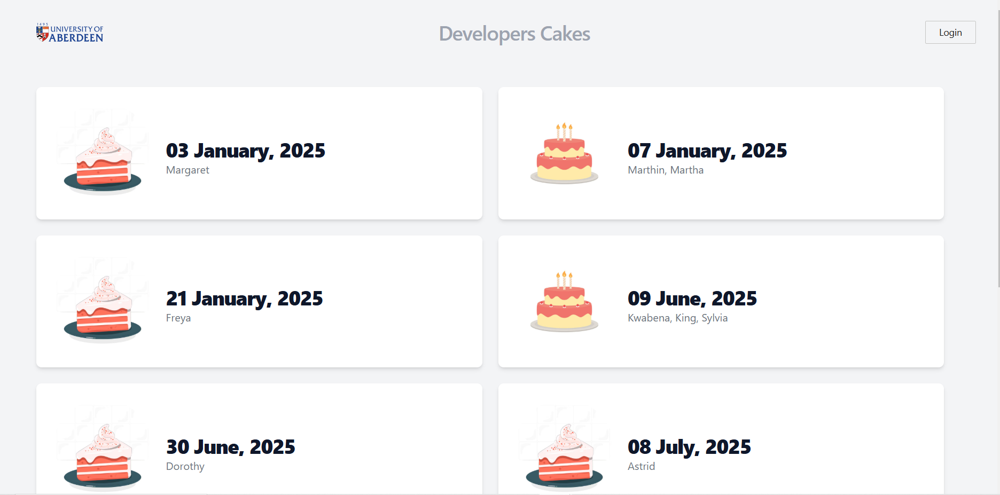
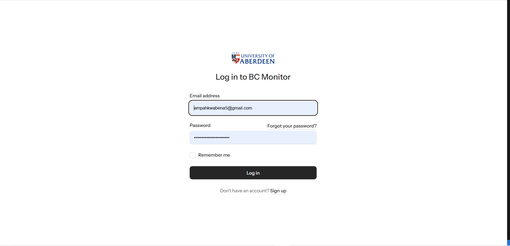
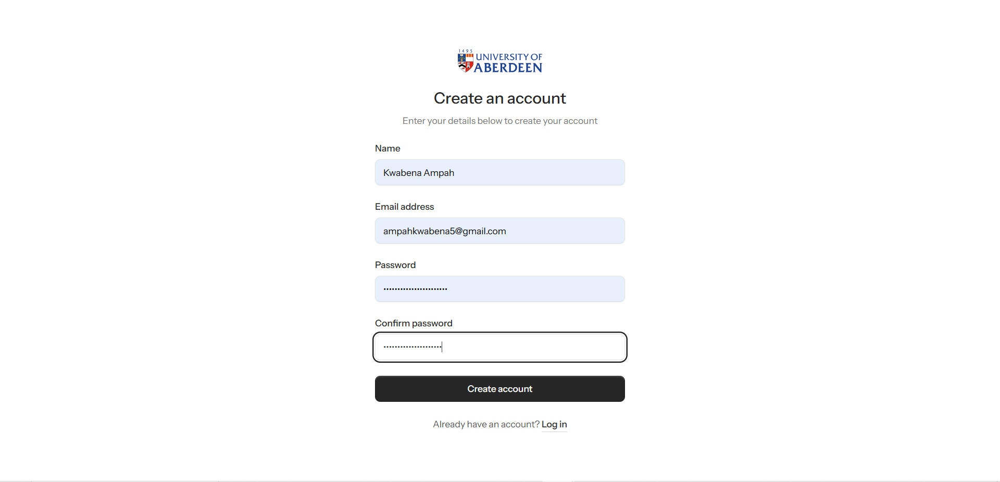
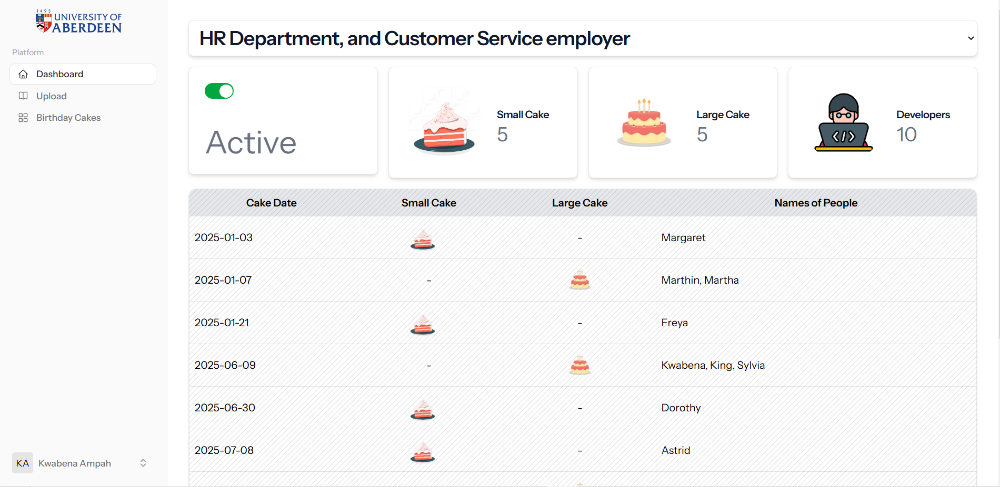
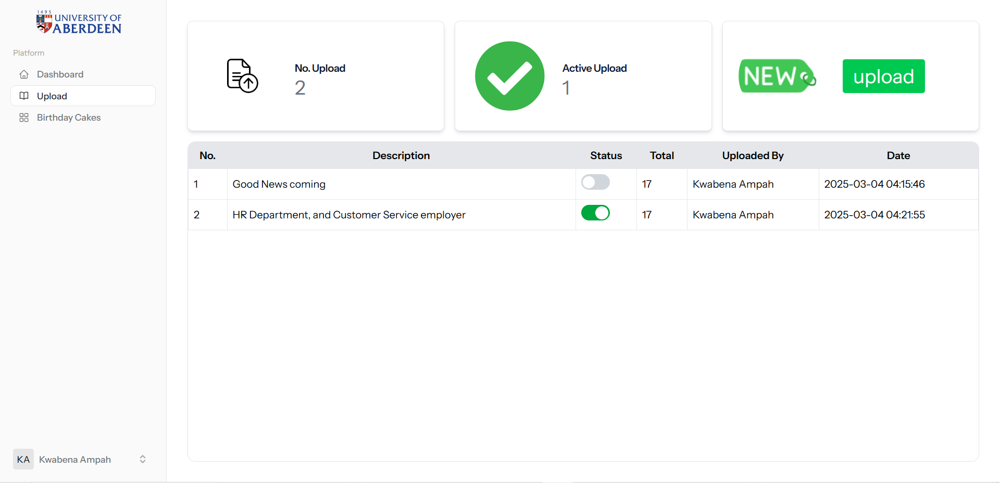
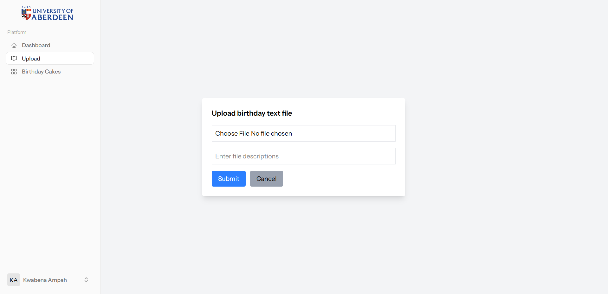

# UOA Birthday Cake Tracker Application

This is a Laravel-based application that helps keep track of developer birthdays and organizes cake days in a workplace. The app calculates **Cake Days** for developers based on their birthdays and generates a schedule for small or large cakes, which is displayed on a large screen monitor in the office.

**GitHub Repository**: [https://github.com/khobbie/uoa-birthday-cake-app.git](https://github.com/khobbie/uoa-birthday-cake-app.git)

## Requirements

- **Laravel**: A PHP framework used for building the backend API.
- **MariaDB**: A relational database to store developer data and birthday information.
- **Tailwind CSS**: For designing a responsive and attractive frontend UI.
- **PHP**: PHP 8.x or higher.
- **Composer**: PHP package manager.
- **Node.js & NPM**: For frontend asset compilation.

## Features

- **Upload Birthday Data**: Upload a text file with developer names and birth dates.
- **Cake Day Calculation**: Determines small and large cake days based on business rules.
- **Working Day Calculation**: Handles weekends, holidays, and non-working days.
- **Frontend UI**: Displays upcoming birthdays and cake days for developers using a calendar-style interface.
- **API Integration**: Backend API to handle calculations and data management.
- **Responsive UI**: Tailwind CSS for a sleek, responsive user interface.

---

## Cake Day Rules

- **Small Cake**: A small cake is given on the first working day after a developer’s birthday.
- **Large Cake**: If two or more birthdays fall on the same day, a large cake is provided for everyone to share.
- **Postponing Cake**: If there is cake two days in a row, a large cake is provided on the second day, and the first day is cake-free.
- **Holiday Handling**: If an employee’s birthday falls on a weekend, Christmas Day, Boxing Day, or New Year’s Day, they get the next working day off.
- **One Cake Per Day**: There will never be more than one cake per day.

### Example Scenarios

- **Dorothy’s Birthday**: If Dorothy's birthday is June 27, 1986, and she gets Friday off, she will have a small cake on Monday, June 30, 2025.
- **Astrid’s Birthday**: If Astrid's birthday is on July 6, 1950, and she gets Monday off, she will receive a small cake on Tuesday, July 8, 2025.
- **Pat & Giselle's Birthdays**: If Pat’s birthday is on Monday, July 14, and Giselle’s is on Tuesday, July 15, they will share a large cake on Wednesday, July 16, 2025.
- **Multiple Birthdays**: Clem, Roberta, and Edith have birthdays on consecutive days, so Clem and Roberta will share a large cake, and Edith will receive a small cake on the next available day.

---

## Installation

### Step 1: Clone the Repository

```bash
git clone https://github.com/khobbie/uoa-birthday-cake-app.git
cd uoa-birthday-cake-app
```

### Step 2: Install Dependencies

To get the application up and running, you need to install both the PHP backend dependencies and the frontend dependencies.

#### Install PHP dependencies using Composer:

First, install the PHP dependencies required by the Laravel application using Composer:

```bash
composer install
npm install && npm run build
```

#### Set up environment variables:

In the project directory run the below ro create the .env:

```bash
cp .env.example .env
php artisan key:generate
```

#### Edit the .env file to set up your database and mail configurations.

First, install the PHP dependencies required by the Laravel application using Composer:

```bash
DB_CONNECTION=mysql
DB_HOST=127.0.0.1
DB_PORT=3306
DB_DATABASE=your_database_name
DB_USERNAME=your_username
DB_PASSWORD=your_password
```

### Step 3: Run Database Migrations And Seeding

Run the database migrations seeds to set up the required tables:

```bash
php artisan migrate

php artisan db:seed

php artisan db:seed --class=RoleSeeder

php artisan db:seed --class=UkHolidaysSeeder
```


### Step 4: Run Application

Run the database migrations seeds to set up the required tables:
Application may be rumning on http://127.0.0.1:8000 
so check you terminal for link

```bash
composer run dev

```

##  Application screen shots and Demo vidoe

Screen for monitoring upcoming birthday cakes in the office
 

Login


Signup


Dashboard


Test file Uploads


Upload Screen 

